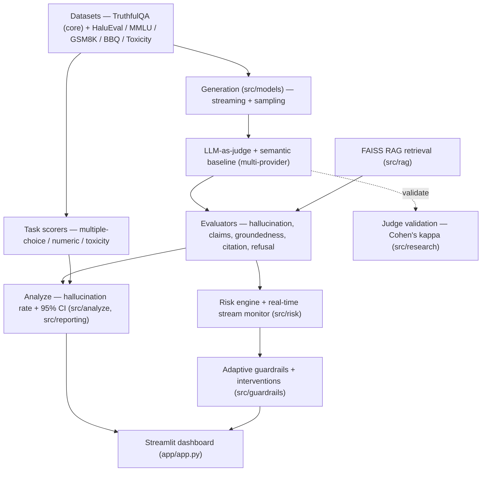
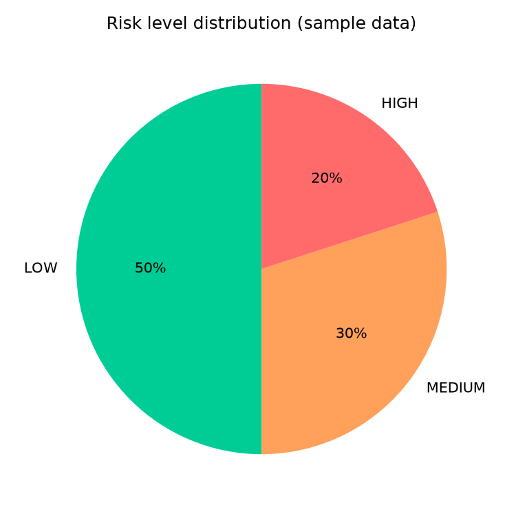
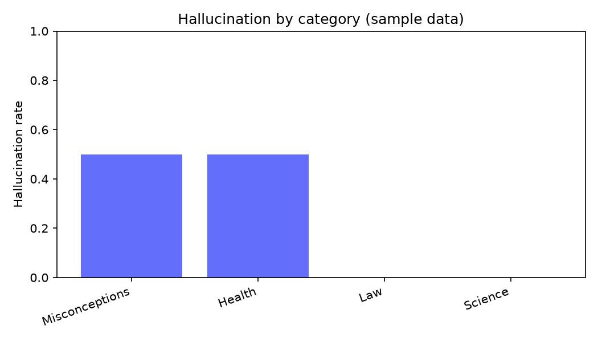
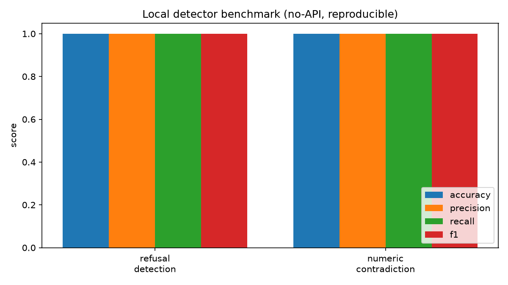

# Factual Accuracy Eval — LLM Hallucination & Reliability Toolkit


Scores free-text LLM answers for factual accuracy against TruthfulQA — reporting a
**hallucination rate with 95% confidence intervals** and a **judge validated by
Cohen's kappa** — then layers on a broader benchmark suite, RAG groundedness,
real-time risk scoring, adaptive guardrails, and a Streamlit dashboard.

> **Scope in one line:** the TruthfulQA evaluator is the *validated core*;
> everything else is implemented, unit-tested, and labelled *roadmap*. See
> [Design philosophy](#design-philosophy) and
> [Status](#status-validated-core-vs-roadmap).

## Architecture



A full ASCII rendering and component-by-component breakdown live in
[ARCHITECTURE.md](ARCHITECTURE.md).

## Status: validated core vs. roadmap

Be clear-eyed about what this repo proves today.

- **Validated core — the real contribution.** A focused TruthfulQA evaluator. It
  scores free-text answers with an LLM-as-judge (plus a cheap semantic baseline)
  and reports a **hallucination rate with Wilson 95% confidence intervals over N
  questions**, broken down by category. Before trusting those numbers,
  `python main.py validate-judge` reports the judge's agreement with your own
  labels as **Cohen's kappa**. Measure with CIs, validate the judge — that loop
  is what makes the eval defensible.
- **Roadmap — implemented, measured, not yet good enough.** The surrounding
  "platform" layers (RAG groundedness, the weighted risk engine, real-time
  stream monitoring, adaptive guardrails, refusal-quality scoring, the dashboard,
  the leaderboard) are working and unit-tested. The groundedness and risk engines
  now have a **validation harness** (`python main.py validate-framework` against
  40 hand labels) — and it honestly shows they're weak: groundedness accuracy
  0.60, risk-score/human Pearson 0.32, with confident fabrications slipping
  through (see [BENCHMARKS.md](BENCHMARKS.md)). Treat these layers as a roadmap
  with a measured baseline to improve against, not as trustworthy metrics.

The only quantitative claims we stand behind today are the **hallucination rate
(+ CIs)** and the **judge kappa**. The rule-based detectors additionally have a
[reproducible, no-API micro-benchmark](BENCHMARKS.md) with exact accuracy on a
small labelled fixture.

## Design philosophy

1. **Validate the judge before you trust it.** An LLM judge is itself a model;
   `validate-judge` reports Cohen's kappa against human labels so you know
   whether the numbers mean anything.
2. **Two scorers, never self-judge.** A strong LLM judge (primary) plus a free
   semantic baseline for sanity-checking; the judge is always a different model
   from the one under test, to avoid self-preference bias.
3. **Truthful *and* informative.** A model that refuses everything is 100%
   truthful and 0% useful, so truthfulness alone is gameable — we always report
   both.
4. **Confidence intervals over point estimates.** Small-N hallucination rates
   come with Wilson 95% CIs; a single percentage hides the noise.
5. **The right metric per task.** Multiple-choice (MMLU/BBQ), numeric (GSM8K),
   and toxicity are *not* forced through the free-text judge — each gets a
   task-appropriate scorer.
6. **Scoped claims.** A small validated core, with platform layers labelled as
   roadmap until they're checked against ground truth. Honesty is a feature.
7. **Reproducible & provider-agnostic.** Deterministic generation, disk caching,
   and one provider-specific function (`chat()`) so swapping models is local.

## Why this design

TruthfulQA gives each question a set of `correct_answers` and `incorrect_answers`.
There is **no retrieved context**, so the right way to score a free-text answer is
to compare it against those reference sets — not to use a RAG "faithfulness"
metric. This project uses two scorers:

1. **LLM-as-judge** (primary): a strong model reads the answer + reference sets
   and returns two verdicts — `truthful` and `informative`. We need both:
   a model that refuses every question is 100% truthful but 0% useful, so a
   pure truthfulness number is gameable.
2. **Semantic similarity** (cheap local baseline): embeds the answer and checks
   whether it is closer to the correct answers or the incorrect ones. Free, fast,
   no API cost — good for sanity-checking the judge and for quick iteration.

The reported **hallucination rate** = share of answers judged *not truthful*.

## Pipeline

    load → generate → score → analyze

Every stage is cached to disk (`cache/`) so re-running analysis costs nothing.

## Setup

    python -m venv .venv && source .venv/bin/activate
    pip install -r requirements.txt
    cp .env.example .env   # then put your key(s) in .env

## Run

Smoke-test on 20 questions:

    python main.py evaluate --models claude-haiku-4-5-20251001 --limit 20

Full run (817 questions):

    python main.py evaluate --models claude-haiku-4-5-20251001

(`run.py` is a thin wrapper around `python main.py evaluate` — same job, kept for
the short smoke-test command.)

Each run writes to `results/`: `overall.csv` (per-model rates + Wilson 95% CIs),
`comparison.csv` (by category), `buckets.csv`, `raw_results.csv` (every row), and
`results.json` — the structured records the Streamlit dashboard reads.

## Swapping providers

`src/models/` (generation for models under test) and `src/scoring.py` (judging)
use the **Anthropic** SDK by default, so both the models under test and the
judges are Claude unless you change them. To evaluate another provider, change
`chat()` in `src/models/generator.py` — everything downstream is
provider-agnostic. Judges additionally route by model name (`gpt-*`/`o1-*` →
OpenAI, otherwise Anthropic), so `config.JUDGE_MODELS` can mix providers. Set the
judge in `config.py`; use the strongest model you can afford, and never make a
model judge itself.

## Multi-provider judges

`config.JUDGE_MODELS` may mix providers (e.g. `claude-opus-4-8` and `gpt-4`).
The judge call routes by model name: `gpt-*`/`o1-*`/`o3-*` go to OpenAI (needs
`OPENAI_API_KEY`), everything else to Anthropic. This lets Claude and GPT judge
each other's answers; `scoring.evaluate_judges` reports the agreement and
disagreement across them. Never let a model judge its own outputs.

## Validate the judge before you trust it

Before reporting any numbers, hand-label ~50 answers yourself and check the
judge's agreement with your labels (Cohen's kappa) via `python main.py
validate-judge --labels your_labels.csv`. If agreement is poor, fix the judge
prompt. This step is what separates a real eval from a vibe.

---

## Project roadmap & quickstart

This repo is being expanded into an "LLM Reliability & Hallucination Intelligence Platform".

Quick start
-----------

1. Create a virtual environment and install dependencies:

```bash
python -m venv .venv
source .venv/bin/activate  # or `.venv\Scripts\activate` on Windows
pip install -r requirements.txt
```

2. Run the full evaluation (requires API keys / models configured):

```bash
python run.py --models claude-haiku-4-5-20251001 --limit 20
```

Run tests
---------

Unit tests are written with pytest and mock external calls to avoid API use.

```bash
pip install pytest
pytest -q
```

CLI commands
------------

```bash
# Core: evaluate models on TruthfulQA, then analyze/plot
python main.py evaluate --models claude-haiku-4-5-20251001 --limit 20
python main.py compare                                 # plot saved results

# Trust: validate the judge against your own labels (Cohen's kappa)
python main.py validate-judge --labels labels.csv

# Broader suite: list benchmarks, run one on a model
python main.py list-datasets
python main.py bench mmlu  --model claude-haiku-4-5-20251001 --limit 100
python main.py bench gsm8k --model claude-haiku-4-5-20251001 --limit 100
python main.py bench toxicity --toxicity-backend detoxify --limit 50

# Live: stream one answer and watch risk in real time
python main.py monitor --question "Do humans use only 10% of their brain?"

# Local, no-API benchmark of the rule-based detectors (+ chart)
python main.py benchmark

# Dashboard
python main.py dashboard          # or: streamlit run app/app.py
```

Project layout
--------------

- `src/core` — unified `EvaluationResult` schema
- `src/benchmark_data` — dataset loaders (TruthfulQA + the benchmark suite)
- `src/models` — generation layer for models under test (+ streaming, sampling)
- `src/evaluators` — hallucination classifier, claim decomposition, groundedness,
  citation linking, numeric-contradiction, self-consistency, refusal quality
- `src/rag` — FAISS retrieval + document ingestion (`ingest.py`)
- `src/guardrails` — adaptive guardrails + interventions
- `src/risk` — weighted risk engine + real-time stream monitor (`realtime.py`)
- `src/research` — judge validation, long-context, adversarial, leaderboard
- `src/reporting.py` — pure helpers feeding the dashboard from `results/results.json`
- `app/app.py` — Streamlit dashboard (reads real results; live eval; upload→RAG)

See the `tests/` folder for example usage and how components are mocked, and
[BENCHMARKS.md](BENCHMARKS.md) for the reproducible no-API detector benchmark.

Dashboard & artifacts
---------------------

Launch the dashboard with `streamlit run app/app.py`. Tabs:

- **Dashboard** — headline metrics, risk-level distribution, hallucination by
  category, all computed from `results/results.json` (shows an empty state until
  you run an evaluation — no mock numbers).
- **Live Evaluation** — paste a Q/A pair to get topic, adaptive guardrail level,
  refusal quality, a live risk score, and the exact risk markers detected.
- **Upload & Analyze** — upload a TXT/MD/PDF, build a FAISS index, then check
  whether an answer is grounded in it (citation linking + numeric contradiction).
- **Leaderboard** — per-model ranking aggregated from real results.

### Gallery

These are **real renders** from `src/reporting.py` (the same code the dashboard
uses), produced by `python scripts/render_dashboard_charts.py`. They show
illustrative *sample* data until you run an evaluation, after which they
regenerate from `results/results.json`:

| Risk distribution | Hallucination by category |
|---|---|
|  |  |

The reproducible, no-API local-detector benchmark renders an exact chart:



For live UI screenshots, run `streamlit run app/app.py` and capture each tab —
see [docs/screenshots/](docs/screenshots/) for the suggested shots and how the
artifacts are generated.

Benchmark suite (beyond TruthfulQA)
-----------------------------------

TruthfulQA is the validated core. Other benchmarks are wired in as **normalized
loaders + task-appropriate scorers** so the suite covers more than one failure
mode (factuality, knowledge, reasoning, social bias, toxicity). List them with
`python main.py list-datasets`; run one with
`python main.py bench <name> --model <m> --limit 50`.

**Local-first / offline & CI:** loaders read `data/cached_benchmarks/` before
touching HuggingFace, so runs are fast and don't depend on the network or hit
rate limits. Populate the cache once with `python scripts/download_benchmarks.py`
(MMLU/GSM8K/BBQ by default; `--datasets` and `--limit` configurable). If a cache
file is missing, the loader downloads and prints a warning pointing at the
script. The cache dir is gitignored — in CI, restore it from a cache step or run
the download script once.

| Dataset | Task | Metric | HF source | Status |
|---|---|---|---|---|
| TruthfulQA | free-text vs references | hallucination rate + CIs | `truthfulqa/truthful_qa` | **validated core** |
| HaluEval | hallucination detection | detection accuracy | `pminervini/HaluEval` | loader+scorer; needs network |
| MMLU | multiple choice (4-way) | accuracy | `cais/mmlu` | loader+scorer; needs network |
| GSM8K | numeric (math) | exact-match accuracy | `gsm8k` | loader+scorer; needs network |
| BBQ | multiple choice (social bias) | accuracy (bias score = roadmap) | `heegyu/bbq`\* | loader+scorer; needs network |
| Toxicity | prompt continuation | mean toxicity / toxic rate | `allenai/real-toxicity-prompts` | real classifier via `detoxify` (default; **fails fast if absent**) |

Tested offline: the pure record normalizers, every task scorer (choice parsing,
numeric extraction, toxicity), and the runner with a stubbed model. **Not**
validated here: end-to-end runs (require HuggingFace downloads). Toxicity uses a
**real classifier** (`detoxify`, installed by default) — `bench toxicity`
downloads the model weights once, then scores locally on CPU. If `detoxify` is
missing it **fails fast** with a clear error rather than silently degrading; the
weak lexical scorer is used only when you explicitly pass
`--toxicity-backend lexical` (and the run prints an "unvalidated" warning).
\*BBQ's HF path varies by mirror; adjust `HF_PATH` in `src/benchmark_data/bbq.py`.

RAG & Groundedness
------------------

The platform now includes a FAISS-based retrieval layer for groundedness checking.

### Initialize a retriever

```python
from src.rag import load_corpus, retrieve
from src.evaluators import verify_citation_support

# Load your corpus (JSON list of {text: "..."} dicts)
load_corpus("data/sample_corpus.json")

# Retrieve docs
docs = retrieve("What is the moon?", top_k=5)

# Verify citation support for an answer
answer = "The moon orbits Earth in about 27 days."
result = verify_citation_support(answer, docs)
print(result)
# Output:
# {
#   "citation_supported": True,
#   "supported_claims": 2,
#   "total_claims": 2,
#   "support_score": 1.0,
#   "unsupported_claims": []
# }
```

Per-claim citation support is computed by embedding similarity to the retrieved
docs, with a numeric-contradiction check layered on top. It is a useful grounding
**signal** — but note it has not been validated against human grounding labels,
and TruthfulQA itself ships no retrieved context (see "Why this design"). Use it
on your own corpus via the Upload tab, and calibrate before trusting it.

Real-Time Risk Engine
---------------------

An optional real-time layer scores token-level risk markers (uncertainty, risky
phrases, contradictions, citation gaps) as text streams in. It is a heuristic
signal for triage, not a validated hallucination predictor.

### Risk Scoring Formula

```
risk_score =
    hallucination_probability * 0.4 +
    unsupported_claims * 0.3 +
    (1 - confidence_level) * 0.2 +
    contradiction_score * 0.1
```

Risk levels: **LOW** (< 0.33), **MEDIUM** (0.33–0.67), **HIGH** (> 0.67)

### Token-Level Risk Monitoring

The engine scans for:
- **Uncertainty markers** ("I think", "probably", "might")
- **Risky phrases** ("I can't verify", "I'm making a guess")
- **Contradictions** ("actually", "wait", "let me revise")
- **Citation gaps** (claims requiring citations without references)

### Active Interventions

When risk is detected, the system recommends actions:

```python
from src.guardrails import recommend_interventions, apply_interventions

risk_info = {
    "risk_level": "HIGH",
    "hallucination_score": 0.75,
    "citation_supported": False,
    "contradiction_score": 0.4,
}

result = recommend_interventions(risk_info)
print(result["recommended_interventions"])
# Output: ["warn_user", "force_citations", "activate_strict_guardrail"]

# Apply interventions to response
response = "The answer is 42."
final = apply_interventions(result["recommended_interventions"], response)
print(final["warnings"])
# Outputs: ["⚠️ WARNING: This response has been flagged for hallucination..."]
```

**Intervention types**:
- `warn_user` — Alert user of potential hallucination
- `force_citations` — Request sources for claims
- `activate_strict_guardrail` — Enable conservative mode
- `ask_clarifying_question` — Request clarification on contradictions
- `switch_model` — Recommend using a more reliable model

These interventions are rule-based recommendations driven by the heuristic risk
score above; they're a scaffold for acting on risk, not a validated safety
guarantee.

Dynamic Guardrails
-------------------

The platform automatically adapts safety prompts and enforcement based on topic detection.

### Topic Detection

The system detects question topics automatically:

```python
from src.utils import detect_topic

result = detect_topic("How do I treat diabetes?")
print(result)
# Output: {"topic": "medical", "confidence": 0.85, "method": "hybrid"}
```

**Supported topics**: medical, finance, legal, science, politics, creative, general

### Adaptive Guardrail Prompts

Different topics receive tailored guardrail instructions:

```python
from src.guardrails import get_guardrail_for_topic, adaptive_guardrails_summary

# Medical topic gets strict enforcement
medical_guardrail = get_guardrail_for_topic("medical")
print(medical_guardrail)
# Output: "You are a medical information assistant. IMPORTANT: You are not a doctor..."

# Creative topic gets lenient enforcement
creative_guardrail = get_guardrail_for_topic("creative")
print(creative_guardrail)
# Output: "You are a creative assistant. Feel free to be imaginative..."

# Get full enforcement settings
settings = adaptive_guardrails_summary("finance")
print(settings["enforcement_level"])  # "strict"
print(settings["require_citations"])  # True
```

**Enforcement levels**:
- `strict` (medical, finance, legal) — High scrutiny, citation required
- `moderate` (science, politics, general) — Balanced checking
- `lenient` (creative) — Allow more flexibility

### Refusal Quality Scoring

Not all refusals are equal. The platform measures refusal quality:

```python
from src.evaluators import score_refusal_quality

# High-quality refusal
refusal = (
    "I cannot provide medical advice, but here's why that matters: "
    "medical decisions require personalized knowledge of your condition. "
    "Instead, I can explain general health concepts. "
    "You should consult a doctor. Check resources like healthline.com for guidance."
)
result = score_refusal_quality(refusal)
print(result)
# Output: {
#     "is_refusal": True,
#     "helpfulness": 0.65,
#     "explanation_quality": 0.70,
#     "educational_value": 0.60,
#     "overall_quality": 0.65
# }
```

**Refusal quality metrics**:
- `helpfulness` — Does it redirect to helpful alternatives?
- `explanation_quality` — Does it explain why refusal is necessary?
- `educational_value` — Does it teach correct concepts or correct misconceptions?
- `overall_quality` — Weighted combination of above

These are heuristic, keyword-based scores for triaging refusals (a bare "I
can't" vs. one that explains and redirects) — not validated quality metrics.

---

## Documentation

| Doc | What's in it |
|---|---|
| [ARCHITECTURE.md](ARCHITECTURE.md) | Full architecture diagram + component breakdown |
| [BENCHMARKS.md](BENCHMARKS.md) | Reproducible local benchmark, model benchmark methodology, suite |
| [DEPLOYMENT.md](DEPLOYMENT.md) | Setup, Docker/cloud deployment, env vars |
| [CONTRIBUTING.md](CONTRIBUTING.md) | Dev setup, tests, conventions, the honesty rule |

## Contributing

Issues and PRs welcome — see [CONTRIBUTING.md](CONTRIBUTING.md). The one
non-negotiable: don't describe a feature as validated without evidence; label
heuristics and roadmap items as such.

## License

[MIT](LICENSE).
